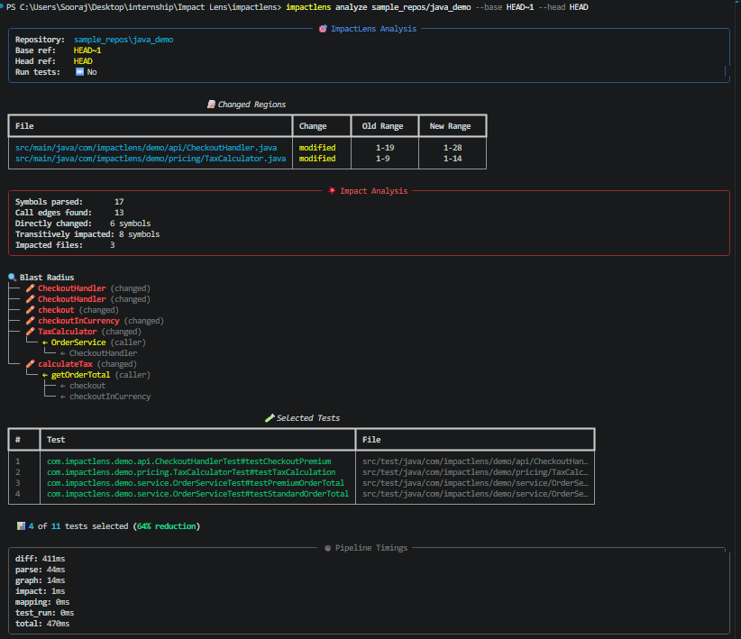
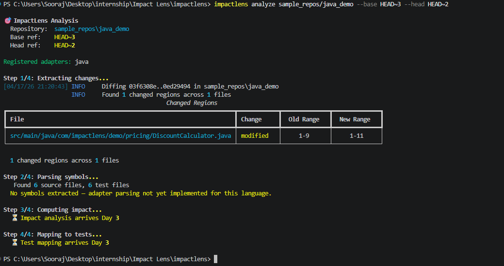
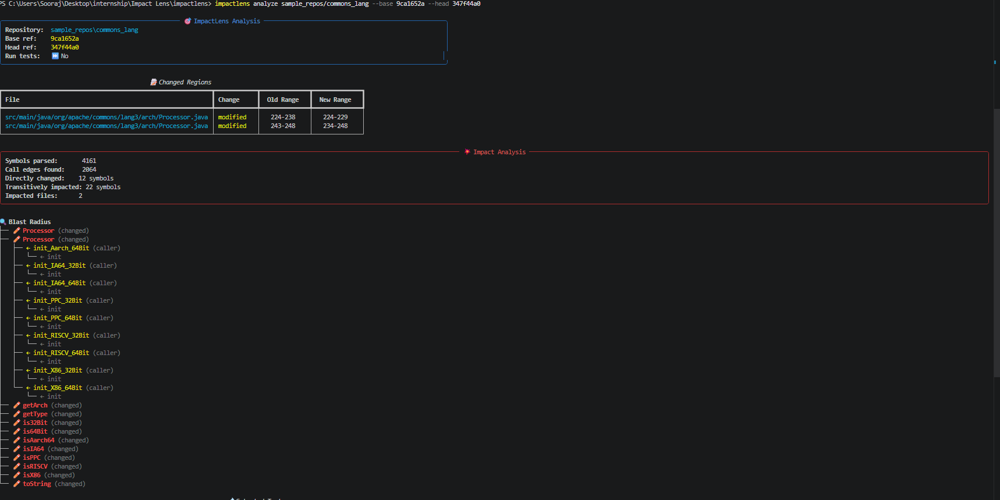
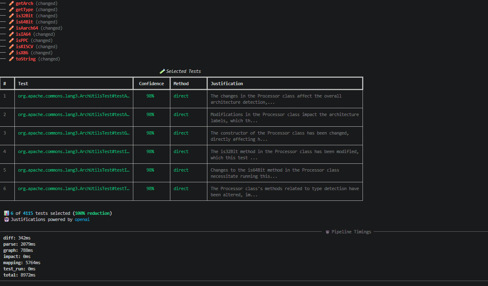

# ImpactLens

**Impact analysis and selective test execution for large codebases — with Gen-AI augmentation for dynamic code paths.**

---

## Table of Contents

- [Problem Statement](#problem-statement)
- [Proposed Solution](#proposed-solution)
- [Tech Stack](#tech-stack)
- [Features](#features)
- [Architecture](#architecture)
- [Project Structure](#project-structure)
- [Setup Instructions](#setup-instructions)
- [CLI Reference](#cli-reference)
- [Demo Scenarios](#demo-scenarios)
- [Demo / Screenshots](#demo--screenshots)
- [Running Tests](#running-tests)
- [Build Progress](#build-progress)
- [Team Members](#team-members)
- [Deployed Link](#deployed-link)

---

## Problem Statement

Engineers working on large codebases face a painful tradeoff: run the full test suite after every change and waste hours, or skip tests and risk regressions. Modern test suites in production Java projects routinely take 30+ minutes to run in full. Most of those tests have nothing to do with the specific change an engineer just made.

Big tech companies (Google's TAP, Meta's Predictive Test Selection) solve this with impact analysis — mapping code changes to the minimum set of relevant tests. Small teams have no such tooling.

ImpactLens brings impact analysis to everyday projects. Given a Java repository and a code change, it identifies the ripple effect of that change through the codebase and runs only the tests that actually exercise the affected code.

---

## Proposed Solution

ImpactLens currently parses Java source files into an abstract symbol table and constructs a call graph of the entire codebase. When given a git diff, it walks the graph in reverse from the changed symbols to identify the full blast radius — every function transitively affected by the change. It then maps that blast radius to relevant JUnit tests using a combination of naming conventions, import analysis, and LLM-assisted semantic matching for edge cases. Finally, it invokes Maven/Surefire to run only those tests and reports results alongside a time-saved comparison against the full suite.

Architecture is deliberately language-agnostic at the core: a `LanguageAdapter` interface separates Java-specific parsing from the generic pipeline, so adding Python, Go, or C++ support later requires only a new adapter — not a pipeline rewrite.

---

## Tech Stack

| Layer | Technology | Purpose |
|:---|:---|:---|
| Orchestration | **Pydantic v2** | Runtime-validated data contracts across every module boundary |
| AST Parsing | **Tree-sitter** + `tree-sitter-java` | Incremental, language-agnostic parsing with query API |
| Graph Engine | **NetworkX** | DAG construction and reverse-reachability traversal |
| Version Control | **GitPython** | Commit-range diff extraction with hunk-level line granularity |
| CLI Framework | **Click** + **Rich** | Composable commands with styled tables, trees, and panels |
| Test Execution | **Maven Surefire** | JUnit 5 selective execution via `-Dtest=` parameter |
| Target Runtime | **Java 17** | Modern JDK with widely-adopted language features |
| LLM Augmentation | **OpenAI** / Anthropic / Groq | Test justifications, confidence scoring, semantic reasoning |
| Dashboard | **Streamlit** + **pyvis** *(Day 5)* | Interactive graph visualization and one-click analysis |
| Deployment | **Streamlit Community Cloud** *(Day 6)* | Free public deployment from GitHub |
| Tooling | **pytest** · **ruff** | Unit testing and linting |

---

## Features

- Parse Java source files into a structured symbol table (classes, methods, imports, invocations)
- Build a transitive call graph of the entire codebase
- Extract changed symbols from a git diff between two commits
- Compute the blast radius of a change via reverse graph traversal
- Map impacted source symbols to JUnit test methods (convention + import-based matching)
- Run only selected tests via Maven Surefire with XML report parsing
- Report time saved versus full-suite execution
- LLM-powered justifications explaining why each test was selected
- Confidence scoring per test (direct / convention / import / transitive)
- Extensible adapter architecture for adding new languages
- Apache Commons Lang validated as a real-world scale target (4161 symbols, 4115 tests)

---

## Architecture

The system follows a ports-and-adapters pattern. The core pipeline is language-agnostic and operates on abstract data types defined in `src/impactlens/core/models.py`. Each supported language provides an adapter conforming to the `LanguageAdapter` interface.

```
                         CLI / Dashboard
                              |
                    Pipeline Orchestrator
                              |
     +----------+--------+--------+---------+---------+
     |          |         |        |         |         |
   Diff     Language   Call     Impact    Test      AI
   Ext.     Adapter    Graph   Analyzer  Mapper   Augment
              |
     +--------+--------+
     |        |        |
   Java    Python   (future)
   Adpt    Adpt*
```

**How it works — a real example:**

When you modify `PriceFormatter.format()` to handle negative amounts:

```
Step 1 — DIFF:    Detects PriceFormatter.java modified (lines 3-14)
Step 2 — PARSE:   Extracts 17 symbols from 6 source files, resolves 13 call edges
Step 3 — GRAPH:   Builds directed call graph across the codebase
Step 4 — IMPACT:  Reverse BFS from PriceFormatter.format
                  Blast radius = {PriceFormatter, CheckoutHandler}
                  NOT impacted: OrderService, DiscountCalculator, TaxCalculator
Step 5 — MAP:     Convention + import matching selects 3 relevant tests
Step 6 — RESULT:  3 of 11 tests selected (73% reduction)
Step 7 — JUSTIFY: LLM explains why each test was selected with confidence scores
```

See [docs/architecture.md](docs/architecture.md) for the full design document.


## Setup Instructions

### Prerequisites

- Python 3.10 or higher
- Git 2.30+
- Java 17 JDK (for running the sample project and its tests)
- Maven 3.8+ (for running JUnit tests)

### Installation

```bash
git clone https://github.com/sjr27-maker/H2H-Interrupt-Error-Impact-Lens.git
cd "IMPACT LENS/impactlens"

python -m venv .venv
source .venv/bin/activate         # Windows: .venv\Scripts\activate

pip install -e ".[dev]"
```

### Initialize sample repo

```bash
bash scripts/setup_sample_repo.sh
```

### Verify installation

```bash
impactlens --version
impactlens languages
```

### Enable AI features (optional)

```bash
pip install -e ".[ai]"
cp .env.example .env
# Edit .env and add your API key (OpenAI, Anthropic, or Groq)
```

The tool works fully without an API key — justifications fall back to templates built from the call graph.

---

## CLI Reference

| Command | Status | Description |
|:---|:---:|:---|
| `impactlens --version` | Done | Print ImpactLens version |
| `impactlens languages` | Done | List all registered language adapters |
| `impactlens analyze <path> --base <ref> --head <ref>` | Done | Full pipeline: diff, parse, graph, impact, test selection |
| `impactlens analyze ... --run-tests` | Done | Execute selected JUnit tests via Maven Surefire |
| `impactlens analyze ... --json-out <file>` | Done | Export full analysis results as JSON |
| `impactlens analyze ... -v` | Done | Verbose mode with call graph trace and resolution details |
| `impactlens dashboard` | Planned | Launch the Streamlit dashboard locally (Day 5) |

---

## Demo Scenarios

**Scenario 1 — Leaf node change (PriceFormatter):**
```bash
impactlens analyze sample_repos/java_demo --base HEAD~4 --head HEAD~3
```
PriceFormatter.format changed. Blast radius: PriceFormatter + CheckoutHandler. 3 of 11 tests selected (73% reduction).

**Scenario 2 — Mid-level ripple (DiscountCalculator):**
```bash
impactlens analyze sample_repos/java_demo --base HEAD~3 --head HEAD~2
```
DiscountCalculator changed. Ripple through OrderService to CheckoutHandler. Wider blast radius.

**Scenario 3 — New file added (CurrencyConverter):**
```bash
impactlens analyze sample_repos/java_demo --base HEAD~2 --head HEAD~1
```
New file with limited callers. Minimal blast radius.

**Scenario 4 — Multi-file change (TaxCalculator + CheckoutHandler):**
```bash
impactlens analyze sample_repos/java_demo --base HEAD~1 --head HEAD
```
Multiple change points. Broadest blast radius across the project.

**Real-world scale target:**
```bash
impactlens analyze sample_repos/commons_lang --base <commit1> --head <commit2>
```
Apache Commons Lang — 4161 symbols, 2064 call edges, 4115 tests parsed.

---

## Demo / Screenshots

**Initial diff detection on sample repo:**


**Full pipeline output with multiple tests:**



**Detailed output for referenced test:**



**Real codebase analysis with LLM-powered justifications:**





---

## Running Tests

```bash
# Full test suite
pytest tests/ -v

# With coverage
pytest tests/ --cov=impactlens --cov-report=term-missing

# Individual modules
pytest tests/test_pipeline.py -v -s    # End-to-end scenarios
pytest tests/test_impact.py -v         # Impact analyzer
pytest tests/test_mapper.py -v         # Test mapper
pytest tests/test_ai.py -v             # AI layer
```

**Test suite covers (40+ tests):**
Pydantic model validation, git diff extraction with line ranges, Tree-sitter Java parsing, JavaAdapter integration, reverse-BFS impact analysis, convention and import-based test mapping, confidence scoring, template justifications, end-to-end pipeline with 6 scenarios, cross-platform path normalization.

---

## Build Progress

### Day 1 — Foundation (Wed, April 16)

- [x] Repository initialized and submitted via Google Form
- [x] Pydantic data models defined (SourceSymbol, CallEdge, ChangedRegion, TestCase, ImpactResult)
- [x] LanguageAdapter abstract base class with 3 abstract methods
- [x] Adapter registry with self-registration pattern
- [x] Java adapter scaffolded with Tree-sitter parser wrapper
- [x] Click + Rich CLI scaffolded (analyze, languages commands)
- [x] Sample Maven project — 5 source classes, 5 JUnit test classes, layered dependencies
- [x] Pytest smoke suite covering the data models
- [x] Architecture and data-contract documentation

### Day 2 — Java Parsing and Git Diff (Thu, April 17)

- [x] Git diff extractor with hunk-level line-range precision via GitPython
- [x] Full Tree-sitter Java parser — classes, methods, constructors, imports, invocations
- [x] JavaAdapter complete — symbol extraction, call resolution with import-aware name lookup, @Test detection
- [x] Call graph builder with ancestors, descendants, and file-level queries via NetworkX
- [x] CLI analyze command running real diff extraction + symbol parsing with Rich table output
- [x] Sample repo enhanced — 5-commit history with scripted setup
- [x] 15+ tests covering parser, adapter, diff extractor, and integration pipeline

### Day 3 — Impact Analysis and Test Execution (Fri, April 18)

- [x] Reverse-BFS impact analyzer with class expansion and 7 unit tests
- [x] Two-layer test mapper (convention + import-based matching) with 5 tests
- [x] Maven Surefire runner with XML report parsing and baseline comparison
- [x] Pipeline orchestrator stitching all stages with per-stage timings
- [x] CLI complete — blast radius tree, test selection table, timing panel
- [x] End-to-end pipeline integration tests with 6 scenarios
- [x] 4 demo scenarios verified (leaf, mid-level, new file, multi-change)
- [x] Cross-platform path normalization for Windows compatibility

### Day 4 — LLM Augmentation and Scale Target (Sat, April 19)

- [x] LLM client wrapper with Anthropic/OpenAI/Groq fallback chain
- [x] Test justification generator — LLM-powered with template fallback
- [x] Confidence scorer — method-aware scoring with depth penalty
- [x] CLI enhanced — confidence %, match method, and justification per test
- [x] Apache Commons Lang 3.14.0 added as real-world scale target (git submodule)
- [x] Pre-computed analysis script for large codebases
- [x] AI layer test suite (confidence scoring, template justifications)
- [x] Optional AI dependencies in pyproject.toml with .env.example
- [x] Auto-loading of .env for API keys via python-dotenv

### Day 5 — Web Dashboard (Sun, April 20)

- [x] Streamlit dashboard with sidebar repo/commit picker and quick-demo buttons
- [x] Interactive pyvis call graph with color-coded blast radius
- [x] Test selection panel with confidence scores and LLM justifications
- [x] Pipeline timing breakdown with bar charts
- [x] Test reduction visualization
- [x] Pre-computed results mode for large codebases
- [x] JSON export download button
- [x] Dashboard CLI command (`impactlens dashboard`)
- [x] Dashboard screenshots for README

## Team Members

| Name | Role | Responsibilities | GitHub |
|:---|:---|:---|:---|
| **Adithya S**| Analysis Engineer | AST parsing, call graph, impact logic | [adithyas56](https://github.com/adithyas56) |
| **Sooraj R Nair** | Platform Engineer | CLI, dashboard, test runner, deployment | [@sjr27-maker](https://github.com/sjr27-maker) |

---

## Deployed Link

Deployment planned for April 21 (Day 6). Live URL will be added here.

---

*T John Institute of Technology — Department of CSE — Hack2Hire— April 2026*
